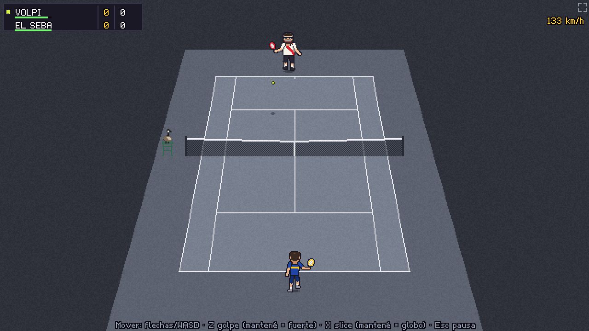

# CHATTAHOOCHEE TENIS

Un videojuego de tenis pixel art sobre los partidos amateur de los Chattahoochees, seis amigos argentinos en Atlanta. Humor de aventura gráfica de los 90, un ganso de umpire y muchos errores no forzados.



## Jugar

👉 **https://sebastiandalessio.github.io/Chattahoochee-Tenis/**

También se puede bajar el juego entero en un solo archivo: [Chattahoochee-Tenis.html](https://sebastiandalessio.github.io/Chattahoochee-Tenis/Chattahoochee-Tenis.html) (se abre con doble clic en Chrome o Edge).

> Estado: **hito 2** — partido jugable con los seis Chattahoochees en pixel art (con sus retratos y trajes alternativos). Las sedes, los especiales y la torre llegan en los próximos hitos.

## Controles

| Acción | 1 jugador | 2P – Jugador 1 | 2P – Jugador 2 |
|---|---|---|---|
| Mover | Flechas o WASD | WASD | Flechas |
| Golpe (mantener = más fuerte) | Z | F | K |
| Slice (tocar) / Globo (mantener) | X | G | L |
| Especial | C | H | Ñ o ; |
| Cargada | V | R | I |
| Pausa | Esc / Enter | Esc | Enter |

- **Saque:** golpe para tirar la pelota, golpe otra vez para pegarle. Cuanto más lleno el medidor, más fuerte (y más riesgo).
- **Dirección:** temprano sale cruzada, tarde sale paralela; izquierda/derecha también apuntan.
- **Profundidad:** hacia el rival = profunda; hacia atrás = corta (con slice, dejadita).

## Para programadores

```bash
npm install
npm run dev        # desarrollo
npm test           # tests
npm run build      # versión web (dist/) + archivo único (dist/Chattahoochee-Tenis.html)
npm run playtest   # prueba automática con capturas
```

Hecho con Phaser 3, TypeScript y Vite. Todo el arte y el sonido se generan en código.
